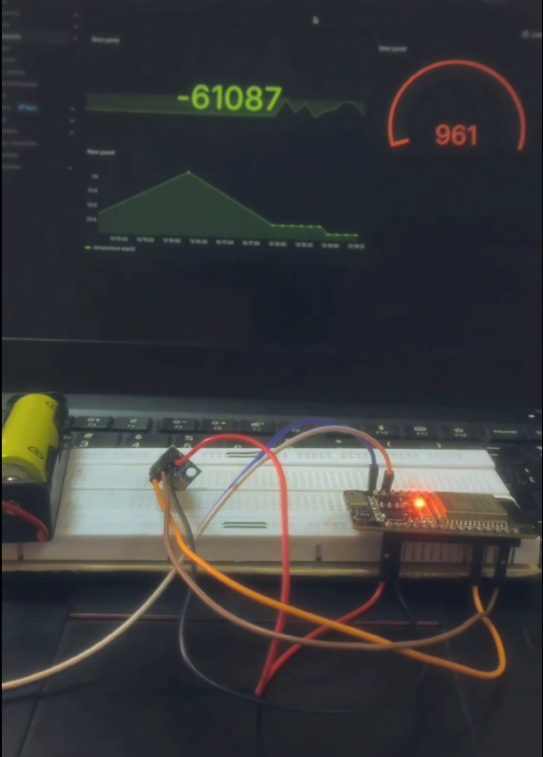
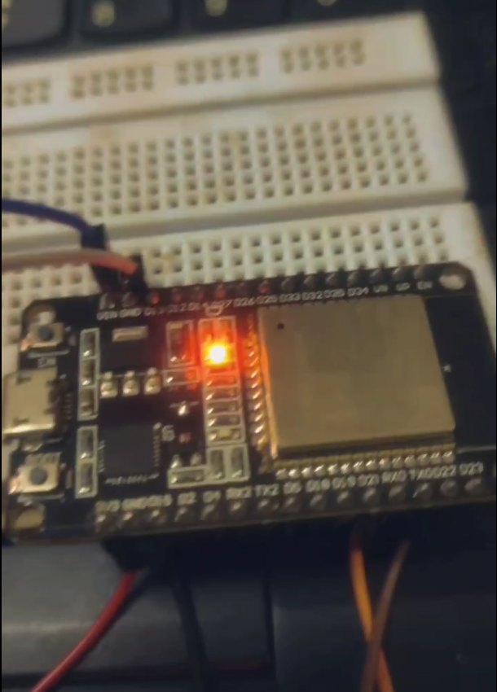

# 🌤️ ESP32 + BMP180 Weather Logger with InfluxDB & Grafana

This project reads **temperature**, **pressure**, and **altitude** from a **BMP180** sensor using an **ESP32**, and sends the data to **InfluxDB** via Wi-Fi. The data is then visualized in **Grafana** in real time.

## 📷 Overview

- Sensor: [BMP180](https://www.adafruit.com/product/1603)
- Microcontroller: [ESP32](https://www.espressif.com/en/products/socs/esp32)
- Database: [InfluxDB 2.x](https://www.influxdata.com/)
- Visualization: [Grafana](https://grafana.com/)

## 🔧 How It Works

1. ESP32 connects to Wi-Fi.
2. Reads sensor data (temperature, pressure, and altitude) from the BMP180.
3. Formats the data using **InfluxDB Line Protocol**.
4. Sends it via HTTP POST to your local InfluxDB instance.
5. Grafana reads the data from InfluxDB and visualizes it in real time.

## 🧰 Hardware Setup

- **ESP32**
  - SDA: GPIO 21
  - SCL: GPIO 22
- **BMP180 Sensor**
  - Connect to ESP32 I2C pins
- Make sure your ESP32 board is properly configured in the Arduino IDE.

## 📸 Screenshots

<p align="center">
    
  
  
</p>


## 📦 Libraries Used

Install these libraries via the Arduino Library Manager:

- `WiFi.h`
- `HTTPClient.h`
- `Wire.h`
- `Adafruit Sensor`
- `Adafruit BMP085` (for BMP180)

## 🔗 InfluxDB Setup

Make sure you have InfluxDB running and set up:

1. Create a bucket: `weather-data`
2. Create an organization: `dot`
3. Generate an API Token with write access
4. Replace the following placeholders in the sketch:
   - `WIFI_NAME`
   - `WIFI_PASSWORD`
   - `LAPTOP_IP` (your computer’s IP running InfluxDB)
   - `iNFLUX_DB_TOKEN`

## 🖥️ Grafana Dashboard

1. Connect Grafana to your InfluxDB 2.x instance.
2. Create a dashboard using the `weather-data` bucket.
3. Use queries like:

```flux
from(bucket: "weather-data")
  |> range(start: -1h)
  |> filter(fn: (r) => r._measurement == "weather")
